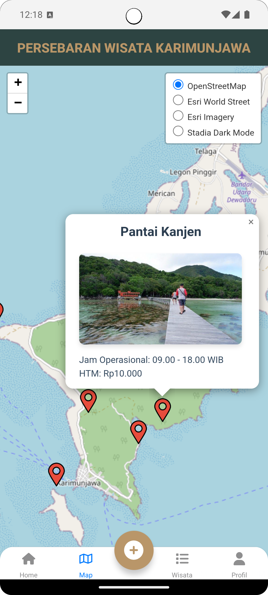

<h1 style="display: inline-flex; align-items: center;">
  <strong>Jelajahi Nusantara Nikmati Pesona Karimunjawa</strong> 
  
</h1>

  

    

      <strong>KARIMUNTRIP</strong> adalah aplikasi interaktif yang dirancang untuk mempermudah eksplorasi wisata di Karimunjawa. Aplikasi ini dilengkapi dengan fitur peta persebaran titik wisata yang memvisualisasikan lokasi-lokasi menarik secara geografis. Pengguna juga dapat menjelajahi daftar lengkap destinasi wisata yang dilengkapi dengan deskripsi dan navigasi langsung ke Google Maps untuk kemudahan perjalanan. Selain itu, aplikasi ini menyediakan fitur tambah data yang memungkinkan pengguna untuk berkontribusi dengan menambahkan informasi wisata baru, sehingga membantu memperkaya pengalaman bersama bagi semua pengguna.
    

  

  

    
  

### Komponen Pembangun
1. **React**
= Framework berbasis javascript yang digunakan untuk membangun aplikasi 
2. **Node JS**
= Platform server-side yang mendukung pengembangan aplikasi menggunakan JavaScript 
3. **Leaflet JS**
= Pustaka JavaScript untuk membuat peta interaktif yang digunakan untuk menampilkan titik lokasi destinasi wisata.
4. **Javascript Object Notation (JSON)**
= Format data berbasis object yang digunakan untuk operasi CRUD antara aplikasi dan server
5. **FontAwesome**
= Pustaka ikon dan font yang digunakan untuk meningkatkan estetika dan daya tarik antarmuka pengguna
6. **JSON Server**
= Server berbasis file JSON yang digunakan untuk membuat API RESTful
7. **Visual Studio Code dan Android Studio**
= *Code Editor* yang digunakan untuk menulis dan mengedit kode aplikasi.

### Sumber Data
1. **Dinas Pariwisata Karimunjawa**
2. **Badan Riset dan Inovasi Provinsi Jawa Tengah**
2. **Biro Pariwisata Karimunjawa**
3. **Sosial Media**
4. **Pengguna Aplikasi**

### Tangkapan Layar Komponen
**Homepage**

  
  

 

**Maps**

  
  

 

**Add dan Edit Data**

  
  

 

**List Data dan Navigasi**

  
  

 

**Portofolio Pengambang**

  
  

